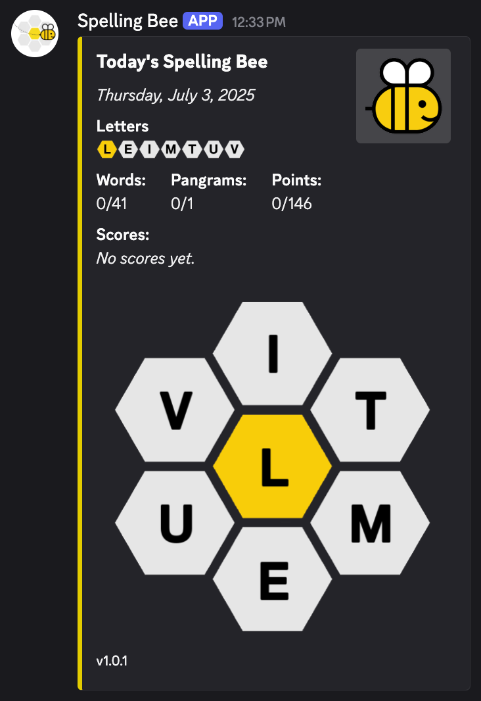
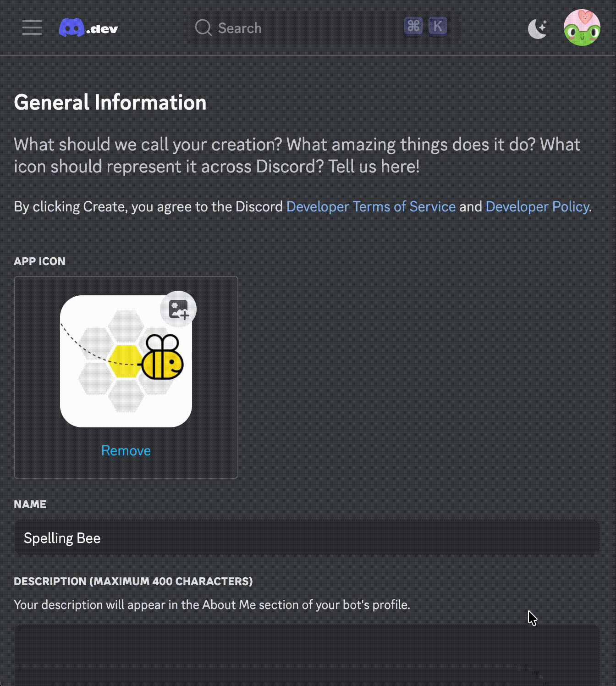

# Discord Spelling Bee Bot 🐝

A Discord bot that brings the New York Times Spelling Bee puzzle to your Discord server! Players can collaborate to find words using the daily letters, track their progress, and compete on a leaderboard.



## Features

- **Daily Puzzle Integration**: Automatically fetches the latest NYT Spelling Bee puzzle each day
- **Visual Letter Display**: Generates and displays the hexagonal letter layout as an image
- **Real-time Progress Tracking**: Updates embed with found words, pangrams, and points
- **Server Leaderboard**: Track individual player scores and rankings
- **Multi-server Support**: Works across multiple Discord servers simultaneously
- **Automated Daily Posts**: Automatically posts new puzzles at specifide time (Defeault 12AM UTC)

## Commands

- `/set_channel` - Set the current channel as the Spelling Bee channel for your server
- `/today` - Manually display today's puzzle progress and statistics
- `/messages_between_sends` - Change max number of messages in spelling bee channel before data is sent again (Default: 20)
- `/start_games_now` - Start (or restart) today's games for all servers (Bot owner only, for debug purposes)

## How to Play

1. Set up a channel using `/set_channel`
2. The bot will automatically post each day's puzzle at 12 AM
3. Players submit words by typing them in the channel
4. Valid words get ✅ reactions, pangrams get 👑 reactions
5. Already found words get ⚠️ reactions
6. Watch the leaderboard update in real-time!

## Setup

### Prerequisites

- Python 3.8+
- Discord Bot Token
- Discord server with admin permissions

### Installation

1. **Clone the repository**
   ```bash
   git clone https://github.com/Dan1elTheMan1el/discord-spelling-bee.git
   cd discord-spelling-bee
   ```

2. **Install dependencies**
   ```bash
   pip install -r requirements.txt
   ```
   Note: Selenium / Chrome driver are only needed for custom emoji uploading

3. **Environment Setup**
   Create a `.env` file in the root directory:
   ```env
   DISCORD_TOKEN=your_bot_token_here
   UTC_TIME=hour_in_24h_UTC_time
   ```

4. **Create Discord Application**
   - Go to [Discord Developer Portal](https://discord.com/developers/applications)
   - Create a new application
   - Go to "Bot" section and create a bot
   - Copy the bot token to your `.env` file
   - Enable "Message Content Intent" in the bot settings

   4.5 **Add Custom Emojis** *(Optional)*
   <div style="display: flex;">
   <div style="flex: 1;">

      - Ensure Chrome is installed
      - Run `upload-emojis.py`
      - Log in to Developer Portal
      - Find your created bot, and navigate to "Emojis"
      - Script will automatically upload necessary emojis and save IDs to file

   </div>
   <div style="flex: 1;">
       
   </div>
   </div>

   5. **Invite Bot to Server**
   - Go to "OAuth2" > "URL Generator"
   - Select "bot" and "applications.commands" scopes
   - Select necessary permissions:
     - Send Messages
     - Use Slash Commands
     - Attach Files
     - Embed Links
     - Add Reactions
     - Read Message History
   - Use the generated URL to invite the bot

6. **Run the Bot**
   ```bash
   python3 discord-spelling-bee.py
   ```

---

*Happy word hunting! 🐝*